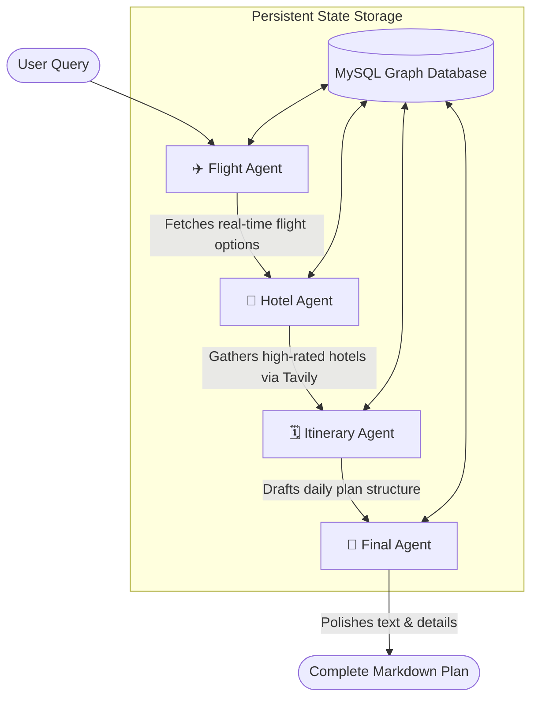

# ✈️ Trippr AI: Multi-Agent Travel Orchestrator

[](https://nextjs.org/)
[](https://fastapi.tiangolo.com/)
[](https://github.com/langchain-ai/langgraph)
[](https://opensource.org/licenses/MIT)

**Trippr AI: Multi-Agent Travel Orchestrator** is a state-of-the-art, real-world multi-agent booking system designed to orchestrate complex travel workflows. Built on a sophisticated asynchronous **LangGraph** architecture, it collaborates in real-time across four specialized AI agents to plan, search, optimize, and deliver tailor-made, download-ready travel plans.

The system is split into an elegant, sky-themed **Next.js 14** web application and a streaming-native **FastAPI** backend bridge that interfaces directly with database persistent layers and real-time live travel web tools.

---

## 🗺️ System & Agent Architecture

Trippr AI employs a state-based multi-agent cooperative architecture where autonomous agents act sequentially, contributing their findings back to a persistent transactional MySQL state graph.



### The Specialized Agent Team:
1. **✈️ Flight Agent**: Connects to the **AviationStack API** to extract real-time available flights, prices, routes, and schedules matching the traveler's request.
2. **🏨 Hotel Agent**: Queries **Tavily Web Search** to aggregate and rank accommodation recommendations, ratings, and price tiers based on budget constraints.
3. **🗓️ Itinerary Agent**: Curates a complete, day-by-day travel timeline, intelligently balancing geography, travel fatigue, and selected flight/hotel details.
4. **🧠 Final Agent**: Takes all inputs, refines the layout, formats tables, and compiles an elegant, comprehensive markdown travel brief ready to save or export.

---

## 📁 Repository Directory Structure

```
Trippr-AI-Travel-Booking-System/
├── backend/
│   ├── __init__.py
│   └── api.py                   # FastAPI SSE stream endpoint
├── frontend-nextjs/
│   ├── app/
│   │   ├── globals.css          # Global Design tokens & Backgrounds
│   │   ├── layout.js            # SEO settings & Page wrapper
│   │   └── page.js              # State manager & Core workflow UI
│   ├── components/              # Beautiful glassmorphic UI modules
│   │   ├── AgentCard.js
│   │   ├── AgentPipeline.js
│   │   ├── Destinations.js
│   │   ├── Hero.js              # High-impact dynamic hero section
│   │   ├── TravelPlan.js        # Markdown renderer & PDF exporter
│   │   └── TripPlanner.js       # Live query form & session tabs
│   ├── public/
│   │   └── airplane_window_view.png  # High-definition visual background
│   └── utils/
│       └── api.js               # Client stream reader
├── tools/
│   ├── flight_tool.py           # AviationStack API runner
│   └── tavily_tool.py           # Web scraping & tavily crawler
├── .env                         # Master API & DB credentials
├── main.py                      # Compiled LangGraph & MySQL StateSaver
├── requirements.txt             # Cleaned backend python requirements
└── LICENSE                      # Project open source License
```

---

## 🛠️ Installation & Setup

### Prerequisites
* **Python**: 3.10 or higher
* **Node.js**: 18.x or higher
* **MySQL Database**: A running instance with database creation privileges

### 1. Database Setup
Create a MySQL database named `langgraph_memory` or utilize your preferred target name:
```sql
CREATE DATABASE langgraph_memory;
```

### 2. Backend Setup
Clone this repository, navigate to the folder, and create a python virtual environment:
```bash
python -m venv venv
source venv/bin/activate  # On Windows: .\venv\Scripts\activate
```

Install backend dependencies:
```bash
pip install -r requirements.txt
```

Create a `.env` file in the root folder with the following variables:
```env
# Language Model API Key
GROQ_API_KEY=your_groq_api_key

# Real-time Web APIs
AVIATIONSTACK_API_KEY=your_aviationstack_key
TAVILY_API_KEY=your_tavily_key

# Persistence Database Connection
DATABASE_URL=mysql://<username>:<password>@localhost:3306/langgraph_memory
```

Run the FastAPI backend:
```bash
python -m uvicorn backend.api:api --reload --port 8000
```
*The API is now running at `http://localhost:8000` with Swagger documentation available at `/docs`.*

### 3. Next.js Frontend Setup
Navigate to the Next.js app directory:
```bash
cd frontend-nextjs
```

Install packages:
```bash
npm install
```

Start the Next.js developer server:
```bash
npm run dev
```
*The web page is now running live at `http://localhost:3000`.*

---

## 🚀 Running Production Builds

Before deploying or committing, compile the optimized NextJS application:
```bash
npm run build
```
This tests ESLint compilation and generates a high-speed, statically optimized build.

To start the production client server:
```bash
npm run start
```

---

## 📝 License

This project is licensed under the **MIT License**. Check out the [LICENSE](LICENSE) file for details.
